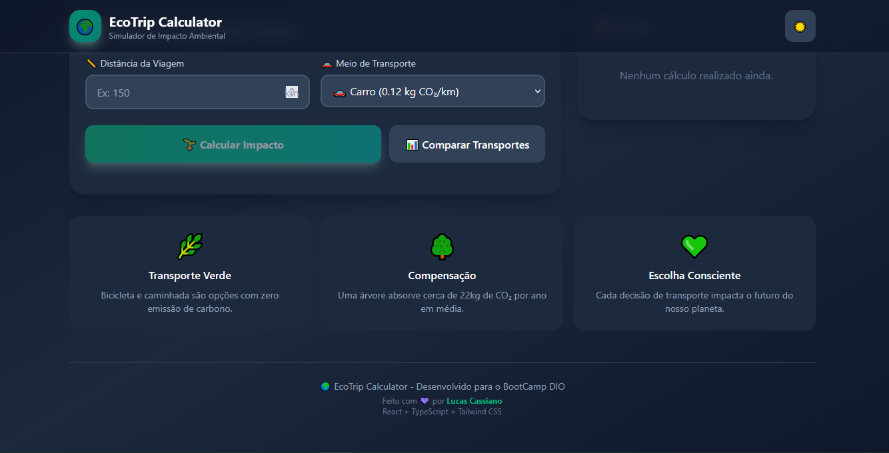

# EcoTrip Calculator 🌱



> Simulador de impacto ambiental e calculadora de pegada de carbono. Construído com React, TypeScript, Tailwind CSS e uma lógica de IA baseada em regras.

**Acesse o site:** **[ecotrip-react.vercel.app](https://ecotrip-calculator.vercel.app/)**

[](https://opensource.org/licenses/MIT)
[](https://vercel.com/dashboard)

---

## 📋 Sobre o Projeto

Eu desenvolvi o **EcoTrip Calculator** como projeto final do Bootcamp da **DIO (Digital Innovation One)**, expandindo a proposta original para além do escopo inicial. O projeto evoluiu de um script simples em Python para uma **Single Page Application (SPA)** moderna, focada em clareza, desempenho e experiência do usuário.

O objetivo do projeto é oferecer uma ferramenta educativa e visual que ajude usuários a compreender o impacto ambiental de diferentes meios de transporte, utilizando **React**, **TypeScript** e **Tailwind CSS**, além de uma lógica de **IA baseada em regras** para fornecer feedback contextual e sugestões mais sustentáveis.

## ✨ Principais Funcionalidades

- **Cálculo em Tempo Real:** Insira a distância e o veículo para ver instantaneamente a emissão de CO₂ (baseado em fatores internacionais).
- **Compensação Ambiental:** Converte o impacto gerado em número de árvores necessárias para compensação anual.
- **Sugestões Inteligentes (IA):** O sistema analisa o contexto (ex: Avião para distâncias curtas) e sugere alternativas mais ecológicas.
- **Histórico Local:** As últimas 10 consultas ficam salvas no navegador (LocalStorage) para consulta rápida.
- **Comparador Visual:** Gráfico de barras comparando a eficiência de diferentes veículos para o mesmo trajeto.
- **Design Moderno:** Interface com tema claro e escuro (Dark Mode) automático e responsivo.

## 🛠️ Tecnologias Utilizadas

Este projeto foi construído utilizando uma stack moderna focada em performance e experiência do desenvolvedor.

- **Front-end:** React 19, Vite, TypeScript
- **Estilização:** Tailwind CSS v4, Lucide React (Ícones)
- **Hospedagem e Deploy:** Vercel
- **Persistência de Dados:** LocalStorage API
- **Lógica:** Algoritmos condicionais (Rule-based AI)

## ⚙️ Como Executar o Projeto Localmente

Para rodar este projeto no seu próprio ambiente:

1.  **Clone o repositório:**
    ```bash
    git clone [https://github.com/EHLuC/ecotrip-react.git](https://github.com/EHLuC/ecotrip-react.git)
    ```
2.  **Entre na pasta do projeto:**
    ```bash
    cd ecotrip-react
    ```
3.  **Instale as dependências:**
    ```bash
    npm install
    ```
4.  **Inicie o servidor de desenvolvimento:**
    ```bash
    npm run dev
    ```
    O terminal irá indicar o endereço local (geralmente `http://localhost:5173`).

## 📄 Licença

Este projeto está sob a Licença MIT. Veja o arquivo [LICENSE](LICENSE) para mais detalhes.

---

Feito com ❤️ por **Lucas Cassiano** ([EHLuC](https://github.com/EHLuC)).
